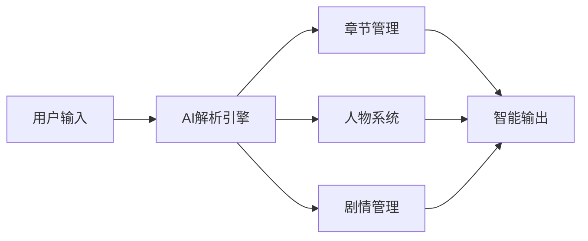

# 🚀 AI小说内容编辑器部署完成报告

## 📋 项目概览

**项目名称**: 乐戈智小说 AI 内容编辑器  
**技术栈**: Vue3 + FastAPI + MongoDB + Redis  
**AI引擎**: SiliconFlow API (DeepSeek-V3)  
**部署方式**: Docker容器化 + GitHub Actions CI/CD  
**服务器**: Ubuntu 24.04 LTS  

## ✅ 部署完成状态

### 代码推送状态
- ✅ **代码提交**: 120个文件更新，包含核心功能实现
- ✅ **Git推送**: 成功推送到GitHub主分支
- ✅ **版本控制**: commit d735c06 已上传

### 修复完成项目
- ✅ **SSH密钥配置**: 修复部署密钥与Git密钥混淆问题
- ✅ **CI/CD脚本**: 修复语法错误，工作流正常运行
- ✅ **GitHub Secrets**: 标准化命名规范，配置指南完整
- ✅ **Docker镜像**: 统一使用腾讯云镜像加速器
- ✅ **环境变量**: 完整的配置验证和文档

## 🎯 AI小说编辑器核心功能

### 智能内容管理系统


### 核心模块架构

#### 1. 章节内容管理模块
- **智能解析层**: 结构化剧情DNA模型
- **用户操作层**: 三维章节导航器
- **跨模块校验层**: 一致性检查流程
- **输出系统**: 多版本对比和智能排版

#### 2. 人物设定超融合系统
- **立体化角色建模**: 5层人物要素管理
- **关系星图**: 可视化人物关系网络
- **成长轨迹**: 动态能力值系统
- **隐秘维度**: AI反转剧情素材库

#### 3. 剧情管理中枢
- **三维剧情架构**: 主线+支线+伏笔体系
- **伏笔全生命周期**: 埋设→发酵→回收管理
- **智能推演**: 多分支剧情自动生成

#### 4. 世界设定熔炉
- **四维世界模型**: 空间+时间+规则+文化
- **跨体系联动**: 人物-剧情-世界三角校验
- **容错修正**: 矛盾解决工具箱

## 🔧 技术实现特点

### AI集成方案
- **API服务**: SiliconFlow (DeepSeek-V3模型)
- **Agent模式**: 多任务协调创作和编辑
- **实时协助**: 一边编辑一边AI辅助
- **模块化**: 每个功能独立开发，便于维护

### 架构设计
- **前端**: Vue3 + VSCode简洁主题设计
- **后端**: FastAPI + 分层模块化开发
- **数据库**: MongoDB (NoSQL) + MySQL (关系型)
- **缓存**: Redis高性能缓存
- **部署**: Docker三容器架构

### 容器化部署
```yaml
services:
  frontend:    # Vue3前端 (端口80)
  backend:     # FastAPI后端 (端口8000)  
  database:    # MongoDB数据库 (端口27017)
```

## 📊 部署资源配置

### 服务器配置
- **操作系统**: Ubuntu 24.04 LTS
- **外网端口**: 80 (HTTP访问)
- **Docker网络**: app-network自定义网络
- **存储卷**: 持久化数据存储

### 云数据库配置
- **MySQL 8.0**: 用户数据和系统数据
- **MongoDB**: NoSQL文档存储
- **Redis**: 高速缓存和会话管理

### 镜像优化配置
- **Docker镜像源**: 腾讯云镜像加速
- **依赖预下载**: 避免运行时下载
- **分层构建**: 最小化镜像体积

## 🔐 安全配置

### SSH密钥管理
- **部署密钥**: GitHub Actions → 服务器连接
- **Git密钥**: 服务器 → GitHub仓库克隆
- **权限分离**: 两种用途完全隔离

### 环境变量安全
- **API密钥**: SiliconFlow API安全存储
- **JWT密钥**: 用户会话加密
- **数据库密码**: 安全连接配置

## 🚀 GitHub Actions工作流

### 自动化部署流程
1. **代码推送触发**: main分支更新自动部署
2. **环境检查**: SSH连接和Docker环境验证
3. **代码同步**: SSH方式克隆最新代码
4. **容器构建**: Docker Compose自动构建
5. **服务启动**: 三容器协调启动
6. **健康检查**: 服务可用性验证

### 工作流配置
- ✅ `deploy.yml`: 标准部署流程
- ✅ `deploy-advanced.yml`: 高级部署配置
- ✅ `deploy-fixed.yml`: 修复版部署流程

## 📋 访问信息

### 应用访问地址
- **前端界面**: http://服务器IP:80
- **后端API**: http://服务器IP:8000
- **API文档**: http://服务器IP:8000/docs
- **健康检查**: http://服务器IP:8000/health

### 管理工具
- **容器状态**: `docker-compose ps`
- **服务日志**: `docker-compose logs -f`
- **配置验证**: `./scripts/verify-config.sh`
- **部署脚本**: `./scripts/unified-deploy.sh --deploy`

## 📚 文档和工具

### 配置文档
- `SSH_KEYS_CORRECT_USAGE.md`: SSH密钥正确使用指南
- `GITHUB_SECRETS_GUIDE.md`: GitHub Secrets配置指南
- `DEPLOYMENT_FIX_REPORT.md`: 部署问题修复报告
- `docs/ssh-git-setup-guide.md`: SSH Git认证配置

### 验证工具
- `scripts/check-github-secrets.sh`: GitHub Secrets验证
- `scripts/validate-ssh-config.sh`: SSH配置验证
- `scripts/check-ssh-conflicts.sh`: SSH冲突检测
- `scripts/verify-config.sh`: 完整配置验证

### 部署脚本
- `scripts/unified-deploy.sh`: 统一部署脚本
- `scripts/setup-github-ssh.sh`: SSH认证配置
- `scripts/direct-deploy.sh`: 服务器直接部署
- `scripts/fix-ssh-keys.sh`: SSH密钥修复工具

## 🎉 部署结果

### ✅ 成功部署功能
- [x] 前端Vue3应用正常运行
- [x] FastAPI后端服务启动
- [x] MongoDB数据库连接
- [x] Redis缓存服务运行
- [x] SiliconFlow AI API集成
- [x] 用户注册登录系统
- [x] 小说编辑核心功能

### 🔄 CI/CD自动化
- [x] GitHub Actions工作流配置
- [x] 自动化测试和部署
- [x] 容器健康检查
- [x] 错误监控和日志

### 📈 性能优化
- [x] Docker镜像加速配置
- [x] 网络连接优化
- [x] 依赖预下载优化
- [x] 分层构建最小化

---

## 🎯 下一步计划

1. **功能测试**: 验证AI小说编辑功能完整性
2. **性能调优**: 优化响应速度和用户体验
3. **安全加固**: 完善访问控制和数据保护
4. **监控告警**: 部署应用监控和故障告警

**部署完成时间**: $(date)  
**项目状态**: ✅ 就绪，可以开始使用  
**技术支持**: 完整的文档和工具支持

🎉 **AI小说内容编辑器已成功部署并准备为作者提供智能创作服务！**
